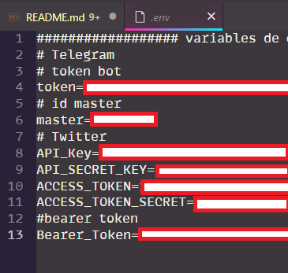

# 🤖 Bots node
En este proyecto proponemos 2 bots en distintas plataformas: telegram y twitter.

## Bot Telegram ✉️ 

El bot de telegram para el Nodo tiene las siguientes características:
- Desplegar rápidamente información del nodo: temperatura, memoria, estado de procesos, ip, etc a solicitud de una (o varias) cuentas maestras. El nodo #bitcoin bitbol esta montado sobre la red TOR por default pues usa un cliente UMBREL (internamente funciona en un container Docker) y este no puede ser desactivado. Se puede tener acceso remoto al nodo por medio de esta red. En un caso de emergencia puede ser una alternativa para tener a mano esta dirección (se debe tener extremo cuidado en la manipulación de estas por seguridad, este es solo un experimento.)
- Interactuar con otros usuarios brindando información que puede ser útil para potenciales usuarios de Bolivia:
	- Información del clima. 
	  Usando un API que entrega datos meteorológicos podemos recopilar y facilitar esta información para todo el territorio. De ser posible brindar info como la radiación solar, atardecer, etc.
	- Verificación de exposición de filtración de datos.
	  En 2021 se filtraron mas de 3 millones de cuentas Bolivianas de facebook con nombres, número celular, perfil, etc. Diversas estafas pueden usar esta información que es pública con propósitos maliciosos. Puedes verificar si tu número de celular (solo de Bolivia) esta asociada a alguna cuenta de facebook filtrada.
	- Gráficas y series de tiempo Bitcoin.
	  El nodo BitBol puede comunicarse y extraer información de la red Bitcoin de manera directa. Se puede brindar algunas gráficas como la mempool el como varia el precio. A futuro análisis onchain.
	- Paga por aprender.
	  Este punto es por ahora una idea. Trata de construir un sistema de pagos en satoshis que por cada pdf que pueda ser entregado y superado un breve test libera una factura en la red lightning ⚡. Existen ejemplos de servicios como Fountain que lo hacen con podcasts. 
- Interactuar con otros usuarios brindando información que puede ser útil para potenciales usuarios de todo Hispano América:
	- Verificador de transacción. 
	  Una transacción bitcoin no se considera irreversible cuando llega a la mempool sino cuando es confirmada al menos 6 veces (confirmación en el contexto de nuevos bloques adelante). Algunos exchanges y servicios crypto consideran suficiente la verificación de 2 bloques. Se busca que el nodo pueda notificar cuando tenga 2 verificaciones de una transacción dada (o se pueda configurar cuantas se quiera). Telegram tiene la ventaja de mantener un poco mas el anonimato para realizar esta consulta, el nodo realiza la verificación directa sin recurrir a ningún otro servicio protegiendo los datos de los interesados. 
	- Verificación de direcciones.
	  Se verifica la dirección en una Blacklist para asegurar un historial limpio de los bitcoins.
	  (Se abandonó esta idea luego de entender los argumentos vertidos por andreas en el video):
	  https://www.youtube.com/watch?v=FFLLx-iufM4
	- Blockclock, mempool stats, price.

## Bot Twitter 🐦

Crear un Bot Twitter es un proceso (en mi experiencia) que demora algunos días en habilitarse desde el portal https://developer.twitter.com/en y realizar las habilitaciones para publicar tuits y modificar el perfil.


La idea central de este bot es brindar un servicio automatizado que recopile información directamente del blockchain como:
  - Blockclock -  Muestra el último bloque verificado.
  - Precio - Muestra el precio de bitcoin.
  - Un reporte hecho cada 12 hrs. (número de transacciones, hashrate, fee promedio).
  - **Ideas** (a evalúar):
    - Movimiento de ballenas.
    - Reporte análisis onchain.
    - Estado de la red (número de nodos)
    - Jugar con facturas lightning.


## Instalación 

Crea un entorno virtual (venv), lo activas, clonas el repositorio e instalas (con pip) los requerimientos.

``` sh
$python -m venv bots
$cd bots/
$source bin/activate
(bots)$git clone https://github.com/jpcrespo/bitbolnode.git
(bots)$cd bitbolnode
(bots)$pip install requerimientos.txt
```
> **Note**
> 
> Para crear los bots e interactuar con los distintos APIs (telegram/twitter) necesitamos almacenar los tokens (llaves) de acceso:
> 
> - En el caso de Telegram es una sola clave. Además que también guardamos el id «master» para verificar accesos privilegiados. 
> 
> - En el caso de Twitter son 4 claves (Bearer es opcional).
> Estas se guardan en un archivo de texto plano y se explicitan en el '.gitignore' (es prudente no compartirlas).



